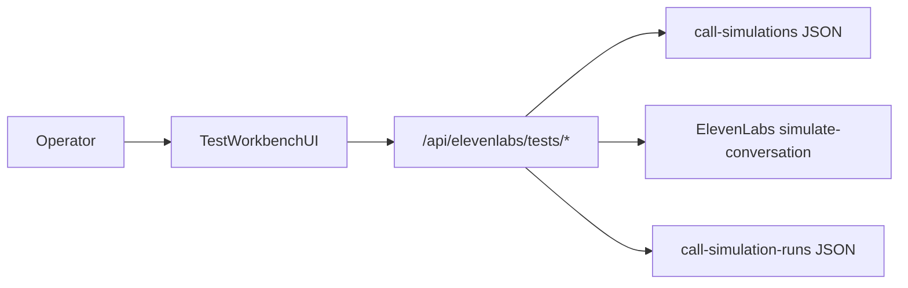

# ElevenLabs Agent Test Workbench — Phase 1

Date: 2026-05-21  
Environment: `ghoststack.rideai.com.au`

## Requirement

Deliver Phase 1 of the enterprise test simulation platform:

- Three-tab workbench UI matching ElevenLabs test editor surfaces
- Runnable **Simulation test** via ElevenLabs API using existing `JSON_*_SIMULATION.json` files
- **Next reply** and **Tool invocation** tabs present but execution deferred to Phase 2
- No mock-tools matrix in Phase 1

## Files Changed

### Backend

- `backend/src/ghostdash_api/integrations/elevenlabs_test_platform.py` (new)
- `backend/src/ghostdash_api/control_api.py` (router mount)
- `backend/src/ghostdash_api/settings.py` (`elevenlabs_convai_agent_id`, `elevenlabs_test_timeout_ms`)
- `backend/tests/test_elevenlabs_test_platform_api.py` (new)
- `.env.example` (`ELEVENLABS_CONVAI_AGENT_ID`, `ELEVENLABS_TEST_TIMEOUT_MS`)

### Frontend

- `ui/src/pages/ElevenLabsTestWorkbenchPage.tsx` (new)
- `ui/src/api.ts` (test list/detail/run client + types)
- `ui/src/App.tsx` (routes)
- `ui/src/components/Sidebar.tsx` (nav label/route)
- `ui/src/components/AppLayout.tsx` (wide canvas + chat suppression)
- `ui/src/components/Header.tsx` (title mapping)

## Architecture Impact



### API contract (Phase 1)

| Method | Route | Purpose |
|--------|-------|---------|
| GET | `/api/elevenlabs/tests/health` | Runner readiness |
| GET | `/api/elevenlabs/tests/simulations` | List simulation JSON packs |
| GET | `/api/elevenlabs/tests/simulations/{file}` | Detail + `tests[]` + execution metadata |
| POST | `/api/elevenlabs/tests/simulations/{file}/run` | Execute simulation via ElevenLabs |

Run flow:

1. Load selected simulation JSON.
2. Resolve `agent_id` from request override, `ELEVENLABS_CONVAI_AGENT_ID`, or source conversation detail.
3. Build `simulate-conversation` payload from repeatable test objective/steps/assertions.
4. POST `https://api.elevenlabs.io/v1/convai/agents/{agent_id}/simulate-conversation`.
5. Normalize pass/fail/completed + transcript summary.
6. Persist run artifact JSON under `call-simulation-runs/`.

## Tests Run

### Backend

```bash
cd backend && python3.12 -m pytest tests/test_elevenlabs_simulations_api.py tests/test_elevenlabs_test_platform_api.py -q
```

Result: **5 passed**

### Frontend

```bash
docker run --rm -v "/var/llamaindex/ghoststack-rag/ui:/workspace" -w /workspace node:22-bookworm-slim bash -lc \
  "corepack enable && corepack prepare pnpm@9.15.0 --activate && pnpm run lint && pnpm run build"
```

Result: **pass**

### Deploy

```bash
docker compose up -d --build control-api ui
```

## Test Output (live smoke)

```bash
curl -s https://ghoststack.rideai.com.au/api/elevenlabs/tests/health
curl -s 'https://ghoststack.rideai.com.au/api/elevenlabs/tests/simulations?limit=2'
curl -I https://ghoststack.rideai.com.au/analysis/test-workbench
```

- Tests health: `ready=true`
- Simulations list: populated after syncing `artefacts/call-simulations` into container
- UI route: `200`

## Manual Verification Steps

1. Open `https://ghoststack.rideai.com.au/analysis/test-workbench`
2. Confirm sidebar item **Test Workbench**
3. Confirm tabs: **Next reply test**, **Tool invocation test**, **Simulation test**
4. On Simulation tab:
   - Select a simulation file
   - Review seeded scenario/criteria from repeatable tests
   - Click **Run simulation test**
   - Confirm run status panel updates
5. On Next reply / Tool invocation tabs:
   - Confirm forms are editable
   - Confirm run action shows **Runnable in Phase 2**

## Cleanup Performed

- Replaced route component for `/analysis/simulation-packs` with workbench (backward-compatible path)
- Left legacy `ElevenLabsSimulationPacksPage.tsx` in repo (unused route) for optional removal in cleanup pass

## Known Risks

1. **Simulation pack persistence in Docker**: `control-api` does not yet mount host `artefacts/call-simulations` read-only; packs must be present in container path (`/app/artefacts/call-simulations`) or copied after recreate.
2. **Agent ID requirement**: run requires `ELEVENLABS_CONVAI_AGENT_ID` or resolvable source conversation `agent_id`.
3. **ElevenLabs latency/cost**: simulation runs can take up to configured timeout (`ELEVENLABS_TEST_TIMEOUT_MS`, default 120s).

## Acceptance Criteria + Verify Commands

- [x] Three-tab workbench reachable from sidebar
- [x] Simulation run API implemented server-side (no browser secret exposure)
- [x] Next reply + Tool invocation UI present, execution disabled for Phase 2
- [x] Automated tests pass

```bash
docker compose ps control-api ui
curl -s https://ghoststack.rideai.com.au/api/elevenlabs/tests/health
curl -s 'https://ghoststack.rideai.com.au/api/elevenlabs/tests/simulations?limit=3'
cd backend && python3.12 -m pytest tests/test_elevenlabs_test_platform_api.py -q
```

## Phase 2 Targets

- Execute Next reply tests via ElevenLabs test APIs
- Execute Tool invocation assertions
- Persist run history in Postgres
- Mount simulation artefacts in `docker-compose.yml` for durable operator workflows
