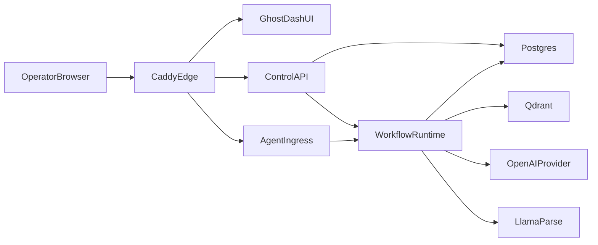
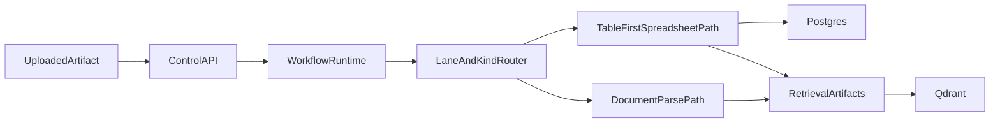
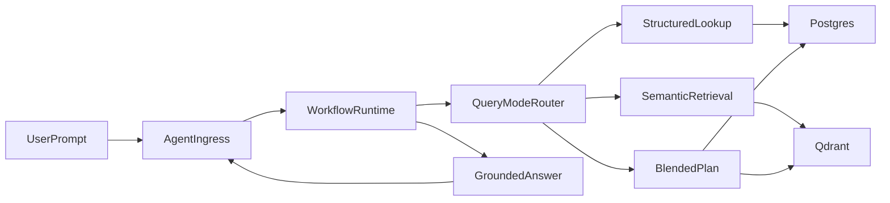

# Architecture

## Overview

## Service Responsibilities

### `control-api`

Thin operator-facing control plane for:

- uploads
- connection management
- runtime defaults
- ingestion run state
- document inventory and structure stats
- capability reporting

### `agent-ingress`

Dedicated runtime query boundary for `/agent/*`.

Responsibilities:

- accept chat and streaming chat requests
- fetch workflow-generated query plans
- return exact structured answers or LLM-grounded answers
- keep all runtime query traffic off `/api/*`

### `workflow-runtime`

LlamaIndex-native workflow service.

Responsibilities:

- run ingestion workflows without a polling loop
- build relational workbook structure for XLSX
- create retrieval artifacts and provenance
- index retrieval artifacts into `Qdrant`
- build structured, semantic, and blended query plans

### `postgres`

System of record for:

- documents and versions
- ingestion runs
- provider connections
- runtime defaults
- workbook sheets, tables, and rows
- retrieval artifact metadata

### `qdrant`

Vector retrieval store for derived retrieval artifacts.

### `ui`

GhostDASH operator console.

### `caddy`

HTTPS edge and route boundary:

- `/api/*` → `control-api`
- `/agent/*` → `agent-ingress`
- `/` → `ui`

## Ingestion Model

### Spreadsheet path

XLSX/XLSM is treated as structured data first:

- immutable source metadata is persisted
- workbook, sheet, table, and row records are stored in `Postgres`
- row and sheet summaries are generated as retrieval artifacts

### Document path

PDF, DOCX, TXT, HTML, and similar files stay document-oriented:

- local or cloud parse lane
- chunked retrieval artifacts with provenance
- vector indexing in `Qdrant`

## Query Model

## Verification Goals

- stack starts cleanly in Docker with `postgres`, `control-api`, `agent-ingress`, `workflow-runtime`, `qdrant`, `ui`, and `caddy`
- `/api/*` and `/agent/*` are distinct runtime boundaries
- XLSX ingest persists relational workbook structure
- exact spreadsheet lookups can be answered without reparsing files
- semantic and blended retrieval still work through `Qdrant`
