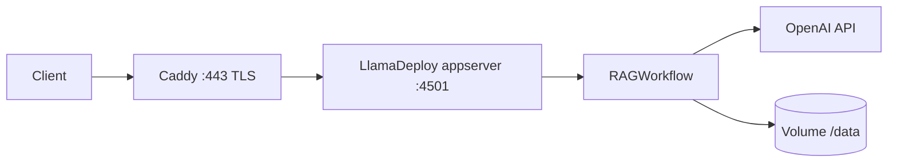

# Architecture — ghoststack-rag

## Overview

## Components

1. **`rag` container** (`app/Dockerfile`)
   - Python 3.12, installs `rag` package with optional `[serve]` extra (`llamactl`).
   - **CMD**: `llamactl serve --host 0.0.0.0 --port 4501 --no-install --no-reload --persistence memory`.
   - Exposes **FastAPI** appserver: health at `/health`, OpenAPI under `/deployments/rag/docs` (deployment name = `[project].name` in `app/pyproject.toml`).

2. **`caddy` container**
   - Terminates TLS for `ghoststack.rideai.com.au` (Let’s Encrypt HTTP-01 on port 80).
   - **Reverse proxy** to `rag:4501` (internal Docker network).

3. **OpenAI**
   - **LLM**: `OPENAI_MODEL` (default `gpt-5.4`).
   - **Embeddings**: `OPENAI_EMBEDDING_MODEL` (default `text-embedding-3-small`).
   - **Auth**: `OPENAI_API_KEY` via environment (`.env` + `docker compose`).

4. **Volumes**
   - `rag_data` → mounted at `/data` in `rag` (optional document store for ingestion paths).
   - `caddy_data` / `caddy_config` → certificate storage for Caddy.

## Workflow (application logic)

Defined in `app/src/rag/workflow.py`:

1. Ingest documents from `StartEvent.path` via `SimpleDirectoryReader`.
2. Build `VectorStoreIndex` (OpenAI embeddings via global `Settings.embed_model`).
3. Retrieve top-k nodes, then complete with OpenAI LLM.

## Configuration sources

| Concern | Source |
|---------|--------|
| Workflow entry | `[tool.llamadeploy.workflows]` in `app/pyproject.toml` |
| Env secrets | Host `.env`, never committed |
| TLS / hostname | `Caddyfile` |
| Compose wiring | `docker-compose.yml` |

## Threat model notes

- Do not expose `rag:4501` publicly; only Caddy should face the internet.
- Restrict SSH and firewall to necessary admins; keep Docker updated.
