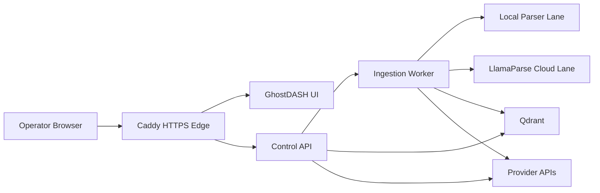

# Architecture V2

## Goal

Move `ghoststack-rag` from a working hybrid RAG stack into a cleaner operator-facing platform with:

- explicit runtime capabilities
- parser-lane readiness surfaced to the UI
- clearer separation between control plane, ingestion worker, and retrieval runtime
- better foundations for higher-fidelity ingestion and stronger retrieval quality

## Target shape

## Service responsibilities

### `ui`

- show runtime readiness and lane availability
- manage provider settings
- start syncs, uploads, and chat
- surface logs, task status, and ingest outcomes

### `api`

- own the public `/api/*` contract
- expose runtime capabilities and readiness
- persist connection and task records
- serve retrieval-backed chat and streaming chat
- remain thin; do not own document parsing or indexing work

### `worker`

- own all ingestion execution
- choose parser lane based on requested policy and runtime readiness
- parse, normalize, chunk, embed, and index
- record parse/index outcomes per document

### `qdrant`

- remain the canonical vector and retrieval payload store

## Principles

1. API owns orchestration, not ingestion execution.
2. Worker owns parsing, chunking, embedding, and indexing.
3. Runtime capabilities must be discoverable by the UI, not inferred.
4. Cloud parsing must fail loudly when not configured.
5. Retrieval quality should improve by enriching chunk metadata before replacing the whole stack.

## Rollout checklist

### Phase 1: Runtime capability surface

- Add `/api/capabilities` that returns:
  - parser lane readiness
  - chat API mode support
  - streaming support
  - vector store/runtime identity
- Show capability cards in the dashboard
- Show whether `LlamaParse` is actually ready or blocked

### Phase 2: Persisted provider/runtime defaults

- Persist default chat API mode in backend state instead of only local UI state
- Surface active provider/model/runtime choices in the dashboard

### Phase 3: Better ingestion metadata

- Record richer parse/index metadata per document
- Distinguish:
  - requested lane
  - actual parse lane
  - parse status
  - index status
- Surface these in UI/logs
- Persist structured non-vector artifacts in the app database when appropriate
  - Example: store spreadsheet workbook JSON in the app DB
  - Example: store `LlamaParse` markdown output in the app DB when cloud parsing is used
- Keep `Llama Stack` internal storage as runtime plumbing only
  - it uses internal SQLite stores for its own metadata/files
  - it is not the operator-facing document database for GhostDASH

### Phase 4: Better chunking and retrieval

- move from simple fixed slicing toward structure-aware chunking
- preserve source section metadata when available
- improve retrieval quality before larger agentic expansion

## First implementation slice

The first slice brought online was `Phase 1`.

Why:

- lowest-risk change
- immediately useful to operators
- exposes whether `LlamaParse` is actually usable
- makes the UI architecture-aware instead of config-assumption-aware

## Current state

`Phase 1` is live, and the first `Phase 3` slice is also live:

- `/api/documents` now exposes:
  - requested lane
  - actual parse lane
  - parse status
  - index status
  - artifact summaries
- the dashboard now shows recent-document ingestion state
- XLSX/XLSM sync now stores a structured `workbook_json` artifact in the app DB
- cloud-lane ingestion is ready to store `llamaparse_markdown` artifacts once `LLAMA_CLOUD_API_KEY` is configured

## Done means

- `/api/capabilities` exists and is live
- dashboard shows local lane, cloud lane, streaming, and API mode readiness
- blocked cloud parsing is visible in the UI before a user runs a failing sync
