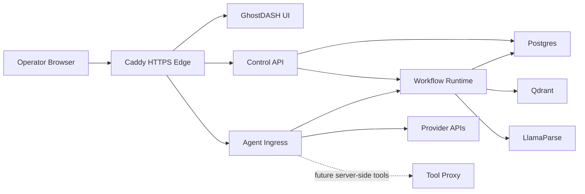

# Architecture V2

## Goal

Keep `ghoststack-rag` moving toward a cleaner operator-facing platform without redoing already-shipped ownership work.

This document is now a roadmap/status guide, not a speculative pre-cutover plan.

## Current target shape

## Core principles

1. `control-api` owns operator-facing control-plane contracts.
2. `agent-ingress` owns runtime chat boundaries, memory/cache behavior, and runtime-profile resolution.
3. `workflow-runtime` owns ingestion execution and query-plan construction.
4. `runtime_profiles` is the single persisted owner of runtime behavior.
5. UI totals and operational truth surfaces must come from authoritative aggregate APIs, not paged preview lists.
6. Retrieval quality should improve through richer metadata and better chunking before heavier agentic expansion.

## What is already shipped

### Phase 1: Runtime capability surface

Shipped:

- `/api/capabilities`
- dashboard capability cards
- explicit cloud-lane blocked/ready visibility
- distinct `/api/*` and `/agent/*` boundaries

### Milestone 1: Control-plane system of record

Shipped:

- canonical `runtime_profiles` persistence
- agents reference one runtime profile through `runtime_profile_id`
- `/api/runtime/defaults` remains only as a compatibility view over the default runtime profile
- duplicate runtime-setting ownership removed from connections and agent rows

This means the old roadmap item "persisted provider/runtime defaults" is no longer a future Phase 2 task. That work is complete in a stronger form.

### Phase 2: Retrieval fidelity and operator truth surfaces

Shipped in the current stack:

- structure-aware text chunking for headed/markdown-like text
- section-aware retrieval metadata (`section_title`, `section_path`, `heading_level`)
- authoritative `GET /api/vector-stats`
- dashboard/vector pages using aggregate totals instead of the capped documents list
- approved-web allowlist support owned by the runtime profile, with per-message use from chat

## Current state

The current platform is already a LlamaIndex-native hybrid in the practical sense:

- LlamaIndex workflows orchestrate ingestion and query planning
- Postgres is the operator-facing system of record
- Qdrant holds derived vector payloads
- agent runtime behavior is resolved from `runtime_profiles`
- spreadsheets persist relational structure first, then retrieval artifacts
- document retrieval now carries richer section metadata through ingestion and citation serialization

What is still intentionally hybrid:

- text chunking/index payload shaping is custom rather than a pure `VectorStoreIndex` pipeline
- the UI still shows citation counts but does not yet render full section-path/heading metadata

## Recommended next phases

### Phase 3: Server-side tool execution boundary

Next highest-value architecture move:

- make `tool-proxy` the only server-side boundary for external tool calls
- keep all browser-to-third-party traffic banned
- route approved external tool execution through one traceable service

### Phase 4: Stable per-agent runtime endpoints

- formalize stable per-agent URLs under `/agent/<agent_id>` or equivalent
- keep ingress stateless for settings ownership
- resolve runtime profiles and tool policy per request from the control plane

### Phase 5: Richer operator observability and citation inspection

- expose more structured citation detail in the UI
- make `section_path`, `heading_level`, and source-type differences inspectable by operators
- keep trace/log correlation visible across `caddy` -> `agent-ingress` -> `workflow-runtime` -> provider/tool boundaries

## Done means

- roadmap docs no longer describe Milestone 1 runtime-profile ownership as future work
- current retrieval/operator-truth work is represented as shipped reality
- next phases focus on tool execution, ingress hardening, and richer operator observability rather than reintroducing duplicate settings ownership
