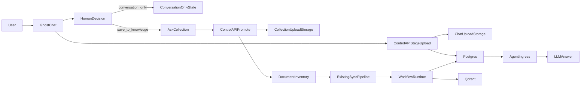

# Chat Upload Approval Flow Artifact

## Purpose

This artifact documents the upload path that starts inside `GhostChat`, keeps raw file bytes out of the LLM and out of direct database blob storage, and only promotes a file into durable agent knowledge after the user explicitly confirms:

1. the file should be saved beyond the current conversation
2. the target collection that should own the file

## Architecture Summary

### Control boundaries

- `GhostChat` is the human entry point for conversation-scoped uploads.
- `control-api` stages files, records approval state, validates collection ownership, and promotes files into the existing document inventory only after confirmation.
- `agent-ingress` reads conversation-scoped upload previews so the LLM can reason over a file immediately in the current chat.
- `workflow-runtime` remains the only ingestion/indexing path for durable knowledge.
- `postgres` stores metadata, approval state, and promoted document inventory.
- filesystem storage remains the home for raw uploaded bytes.
- `qdrant` stores only derived retrieval artifacts after ingestion.

## End-To-End Flow

## Storage Model

### Raw file bytes

- staged conversation uploads are written under `upload_dir/_chat/<conversation_id>/<upload_id>/`
- promoted durable files are moved into `upload_dir/<collection_slug>/`

### Postgres records

- `chat_uploads` stores conversation-scoped file metadata, extracted preview text, approval state, and promotion linkage
- `documents` is created only after a human confirms durable persistence and a valid collection is supplied

### Vector storage

- no vectors are written during the staging step
- vectors are created only after promotion and `sync`

## Conversation States

The implemented upload record lifecycle is:

- `uploaded_pending_decision`
- `conversation_only`
- `awaiting_collection`
- `approved_for_indexing`

Additional future-safe states already anticipated by the UI and plan:

- `indexing`
- `indexed`
- `rejected`

## Human Workflow

### Conversation-only path

1. User talks to the assistant.
2. Assistant can ask for a file when the answer depends on missing document context.
3. User attaches the file in `GhostChat`.
4. `control-api` stages the file and extracts a preview for conversation use.
5. User chooses `Use only in this conversation`.
6. The file stays available to the current conversation, but no `DocumentRecord`, sync run, or vector write is created.

### Durable knowledge path

1. User attaches the file in `GhostChat`.
2. User chooses `Save to agent knowledge`.
3. System pauses in `awaiting_collection`.
4. User selects a collection.
5. `control-api` validates the collection and promotes the staged file into the collection-owned upload directory.
6. A `DocumentRecord` is created.
7. The UI starts the existing `/api/sync` flow for that collection.
8. `workflow-runtime` performs parsing, artifact generation, and vector indexing.

## LLM Behavior Contract

`agent-ingress` now carries an explicit runtime instruction:

- if a user appears to depend on a missing document, ask whether they want to upload it
- if the user wants durable knowledge, ask whether it should be persisted and which collection it belongs in before treating it as saved knowledge

Conversation-scoped upload previews are injected into the prompt as `Conversation upload context`, which means:

- the file can influence the current answer immediately
- the same file is not automatically treated as indexed enterprise knowledge

## Acceptance Criteria

- raw file bytes are staged on disk, not inserted into the DB as binary blobs
- conversation uploads are usable in the current chat before durable ingestion
- durable promotion cannot complete without an explicit collection selection
- durable indexing still runs through the existing collection-backed sync pipeline
- promoted documents carry a `chat_upload_id` trace in metadata for auditability

## Human Verification

1. Open `GhostChat`.
2. Start a conversation with an agent.
3. Ask a question that naturally invites a file upload.
4. Attach a small text or PDF file.
5. Verify the chat upload appears with `uploaded_pending_decision`.
6. Choose `Use only in this conversation`.
7. Ask a question about the uploaded file and verify the assistant uses the staged context.
8. Attach another file.
9. Choose `Save to agent knowledge`.
10. Verify the UI requires a collection before indexing starts.
11. Confirm a collection and wait for sync to finish.
12. Ask a retrieval question that should now be answered from the collection-backed knowledge base.

## Verify Commands

- `git status -sb`
- `docker ps --format 'table {{.Names}}\t{{.Image}}\t{{.Ports}}'`
- `docker compose ps`
- `docker compose logs control-api --tail=120`
- `docker compose logs agent-ingress --tail=120`
- `docker compose logs workflow-runtime --tail=120`
- `cd /var/llamaindex/ghoststack-rag/backend && pytest tests/test_chat_uploads.py`
