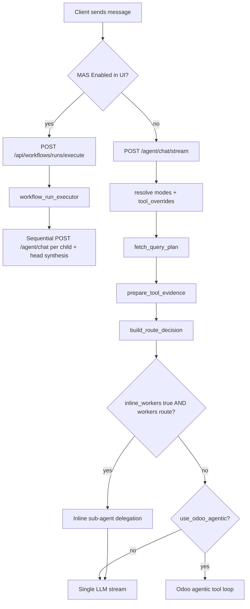

# GhostChat Routing Architecture

This document describes **exactly** how a user message is routed from bare API chat through optional tools, knowledge retrieval, and multi-agent orchestration. Use it when debugging unexpected citations, sub-agent calls, or Odoo behaviour.

## Design principle: opt-in layers

Nothing is forced. Each capability is a separate layer that must be explicitly enabled by the client (GhostChatUI checkbox/toggle) or API field.

| Layer | Client control | Backend gate | Default when omitted |
|-------|----------------|--------------|----------------------|
| Direct LLM | Send chat with no extras | `route_type: direct` | **On** |
| Knowledge base (KB) | `tool_overrides.kb: true` | `_resolve_kb_enabled()` | **Off** |
| Odoo tools | `tool_overrides.odoo_primary: true` | `_apply_tool_session_overrides_to_plan()` | **Off** |
| Inline worker delegation | `tool_overrides.inline_workers: true` | `_should_emit_multi_agent_handoff_trace()` | **Off** |
| Persisted MAS workflow | GhostChatUI MAS **Enabled** toggle | `POST /api/workflows/runs/execute` | **Off** |
| Non-standard workflow mode | `workflow_mode` on request | `resolve_workflow_mode()` | `standard` |

GhostChatUI defaults: tools **off**, MAS **disabled**, child-agent checkboxes **empty until MAS enabled**.

---

## Execution paths (mutually exclusive entry points)



### Path 1 — Direct stream chat (default)

- **Endpoint:** `POST /agent/chat/stream`
- **Frontend:** `useGhostChat.sendPrompt()` when `isMultiAgentMode === false`
- **Code:** `agent_ingress.py` stream handler (~5234+)

### Path 2 — Persisted MAS workflow

- **Endpoint:** `POST /api/workflows/runs/execute` (control-api → workflow_run_executor)
- **Frontend:** `executeWorkflowRun()` when MAS toggle is **Enabled**
- **Code:** `workflow_run_executor.py`, `workflow_runs.py`
- Child steps call `/agent/chat` with `tool_overrides` copied from the workflow run request.

### Path 3 — Inline worker delegation (legacy stream orchestration)

- **Only when:** `tool_overrides.inline_workers: true` **and** `route_type === "workers"` **and** handoff heuristics match
- **Code:** `_should_emit_multi_agent_handoff_trace()`, `_resolve_orchestration_sub_agents()`
- **Default:** **disabled**. GhostChatUI always sends `inline_workers: false`.

---

## Request fields (ChatRequest)

Defined in `schemas.py` → `ChatRequest`.

| Field | Purpose | Default |
|-------|---------|---------|
| `message` | User text | required |
| `agent_id` | Agent profile | server default agent |
| `conversation_id` | Thread continuity | new conversation |
| `conversation_mode` | `quick` / `board` / `working_session` | `quick` |
| `workflow_mode` | Specialist modes (`standard`, `odoo_specialist`, `bp_mode`, …) | `standard` |
| `tool_overrides` | Per-session opt-in map | `{}` → all tools **off** |
| `api_mode` | `responses` or `chat_completions` | agent profile |
| `surface` | `ghost_chatui`, `prod_chatui`, … | affects public stripping |
| `use_approved_web` | Approved URL fetch | `false` |

### `tool_overrides` keys

| Key | When `true` | When `false` or absent |
|-----|-------------|------------------------|
| `kb` | Session may use knowledge retrieval (still requires corpus selection + explicit message intent) | No indexed document search |
| `odoo_primary` | Odoo tool plan + agentic loop allowed | Tool plan forced to `mode: none` |
| `inline_workers` | Stream may delegate to DB sub-agents | Never runs inline sub-agents |

### Knowledge base (corpus) selection

| Rule | Behavior |
|------|----------|
| `tool_overrides.kb: false` | `corpora` resolved to `[]` — no KB access |
| `tool_overrides.kb: true` + empty `corpora` | No KB access (user must pick collections in GhostChatUI) |
| `tool_overrides.kb: true` + `corpora: ["slug-a"]` | Search **only** those collections |
| Message intent | Semantic/structured retrieval runs only when the message explicitly requests documents, mentions a filename, asks for file inventory, or has structured field signals (e.g. invoice row) |

GhostChatUI: **Tools → Knowledge bases** multi-select sends collection `slug` values as `corpora`.

Implementation: `_tool_override_enabled()` in `agent_ingress.py` — **default is `false`**.

---

## Routing pipeline (stream path, step by step)

1. **Resolve agent + runtime profile** — LLM connection, tool policy, guardrails, corpora.
2. **Resolve modes** — `resolve_conversation_mode()`, `resolve_workflow_mode()`.
3. **Tool readiness** — `build_tool_readiness_summary(session, tool_overrides=…)`.
4. **KB flag** — `_resolve_kb_enabled(kb_tool, tool_overrides, conversation_mode, message)`.
   - Casual greetings in `quick` mode skip KB even when `kb: true`.
5. **Query plan** — `fetch_query_plan()` → workflow-runtime `/internal/query-plan`.
   - Sets `tool_plan`, `citations`, retrieval prompt.
6. **Session overrides** — `_apply_tool_session_overrides_to_plan()` clears Odoo plan when `odoo_primary: false`.
7. **Tool evidence** — `prepare_tool_evidence()` executes/previews Odoo ops; may run Odoo MAS v2 for Finance Agent name match.
8. **Route decision** — `build_route_decision()` → `route_type`: `direct` | `workers` | `suggest_specialist`.
9. **Structured log** — `_log_chat_route_decision()` → JSON log route `chat.route_decision`.
10. **Execution branch:**
    - Odoo agentic loop if `should_use_odoo_agentic()` and `odoo_primary` enabled
    - Inline workers if `inline_workers` enabled
    - Else single LLM stream
11. **Persist** — `route_decision_json` on assistant message; SSE `start`/`done` include `route_decision` (except production surface strip).

---

## `route_decision` shape

```json
{
  "route_type": "direct",
  "rationale_summary": "Direct answer: no tool-backed or multi-agent escalation required for this turn.",
  "document_intent": false,
  "tool_expectations": {
    "kb_enabled": false,
    "web_enabled": false,
    "odoo_ready": true,
    "tool_plan": null
  },
  "recommended_workers": [],
  "llm_execution": []
}
```

`recommended_workers` is **advisory metadata only** — it does not trigger sub-agents. Execution uses explicit paths above.

### `execution_path` (log field only)

Logged inside `chat.route_decision` details:

| Value | Meaning |
|-------|---------|
| `direct_llm` | Single model, no tools/workers |
| `tool_backed_single_agent` | Tools/KB in prompt, one lead model |
| `inline_worker_delegation` | Stream sub-agent handoff (requires `inline_workers: true`) |
| `odoo_agentic_loop` | Multi-step Odoo tool loop |
| `mas_workflow_run` | Persisted workflow executor |
| `specialist_suggestion` | Suggest creating a specialist agent |

---

## Observability

### Server logs (agent-ingress)

Every chat turn emits structured JSON:

```json
{
  "trace_id": "<hex>",
  "service": "agent-ingress",
  "route": "chat.route_decision",
  "status": "ok",
  "details": {
    "execution_path": "direct_llm",
    "route_type": "direct",
    "rationale_summary": "...",
    "tool_overrides": {"kb": false, "odoo_primary": false, "inline_workers": false},
    "conversation_mode": "quick",
    "workflow_mode": "standard",
    "agent_id": "...",
    "kb_enabled": false,
    "message_excerpt": "hello"
  }
}
```

**How to grep:**

```bash
docker logs ghoststack-rag-agent-ingress-1 2>&1 | grep chat.route_decision
docker logs ghoststack-rag-agent-ingress-1 2>&1 | grep '<trace_id_from_response>'
```

### Stream events (GhostChatUI)

- SSE `start`: early `route_decision` (no `llm_execution` yet)
- SSE `done`: final `route_decision` with `llm_execution` steps
- GhostChatUI **Analysis** tab → **Last Route Decision** panel mirrors the latest assistant turn

### Database

- Table: `agent_messages.route_decision_json`
- Control API message views expose `route_decision` on historical messages

---

## GhostChatUI controls (Session Details)

| Tab / control | Effect |
|---------------|--------|
| **Tools** → “Use tools and knowledge retrieval” | Sets `tool_overrides.kb` and `odoo_primary` |
| **MAS** → Enabled/Disabled | Switches between stream chat and workflow execute |
| **MAS** → child checkboxes | Only used when MAS **Enabled**; not auto-selected on load |
| **Analysis** → conversation mode | `conversation_mode` on each request |
| **Last Route Decision** | Live `route_decision` from stream |

---

## Bare API examples

### Minimal direct chat (no tools, no KB)

```bash
curl -sS -N -X POST http://agent-ingress:8001/agent/chat/stream \
  -H 'Content-Type: application/json' \
  -d '{
    "message": "hello",
    "surface": "ghost_chatui",
    "conversation_mode": "quick",
    "workflow_mode": "standard",
    "tool_overrides": {"kb": false, "odoo_primary": false, "inline_workers": false}
  }'
```

Expect: `route_type: direct`, zero citations, log `execution_path: direct_llm`.

### Tools + KB enabled

```bash
"tool_overrides": {"kb": true, "odoo_primary": true, "inline_workers": false}
```

Expect: possible citations and Odoo tool plan for finance/Odoo-intent messages; still **no** inline sub-agents unless `inline_workers: true`.

### Full MAS (persisted workflow)

Use control-api execute endpoint with selected `agent_ids` and optional `tool_overrides` — not the stream endpoint.

---

## Key source files

| Area | Path |
|------|------|
| Stream + routing | `backend/src/ghostdash_api/agent_ingress.py` |
| Query plan / KB | `backend/src/ghostdash_api/workflows.py`, `workflow_runtime.py` |
| MAS executor | `backend/src/ghostdash_api/workflow_run_executor.py` |
| Schemas | `backend/src/ghostdash_api/schemas.py` |
| Telemetry | `backend/src/ghostdash_api/telemetry.py` |
| GhostChatUI state | `Ghost-chatUI/src/lib/state/useGhostChat.ts` |
| GhostChatUI API | `Ghost-chatUI/src/lib/providers/api.ts` |
| Session panel | `Ghost-chatUI/src/components/layout/RightPanel.tsx` |

---

## Common misreadings

1. **Checked MAS child agents ≠ running MAS** — only the **Enabled** toggle starts workflow execution.
2. **`route_type: workers` ≠ sub-agents** — inline delegation requires `inline_workers: true`.
3. **Workflow definition picker ≠ `workflow_mode`** — YAML workflow IDs (e.g. `mas_consult_v1`) are for persisted MAS, not the `WorkflowMode` enum on chat requests.
4. **Production surface** — `prod_chatui` strips `route_decision` from SSE via `PublicStreamPresenter`; logs still contain `chat.route_decision`.

---

## E2E verification

Run the bundled script after deploy:

```bash
/var/llamaindex/ghoststack-rag/scripts/e2e_chat_routing.sh
```

It exercises bare chat, tools-off hello, and validates `route_type` + citation counts from SSE events.
