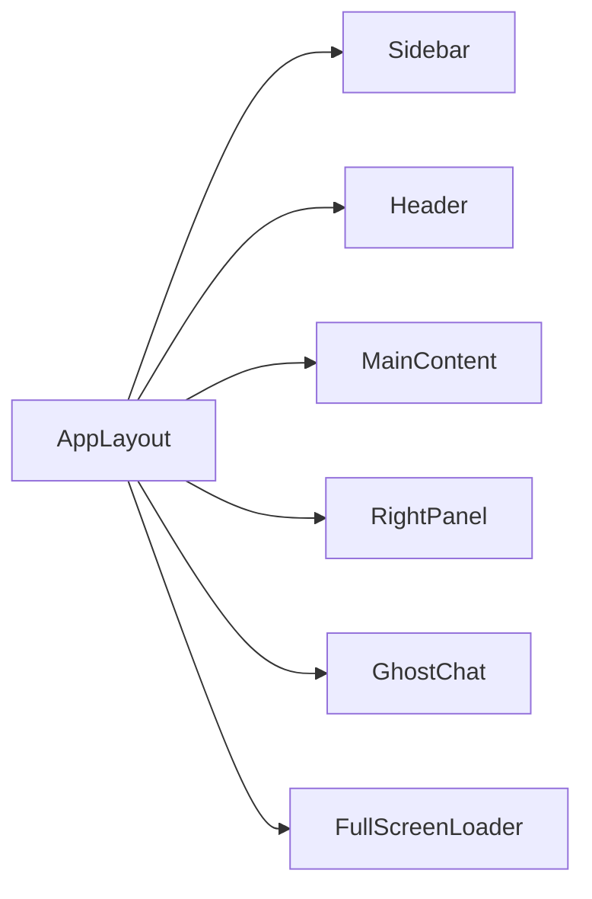

# GhostDASH UI Architecture

## Purpose

GhostDASH is the operator console for the rebuilt RAG platform.

It owns:
- provider configuration
- full-sync orchestration
- document uploads
- retrieval-backed chat
- visibility into the live stack state

## Frontend Stack

Use:
- `Vite`
- `React`
- `TypeScript`
- `Tailwind CSS`
- `pnpm`

This matches the strongest existing frontend convention in the wider workspace.

## Layout Model

Required components:
- `AppLayout`
- `Sidebar`
- `Header`
- `RightPanel`
- `GhostChat`
- `FullScreenLoader`

## Visual Rules

The supplied GhostDASH HTML/CSS template is the source of truth.

Mandatory rules:
- preserve the CSS variable palette
- preserve `Neon Orange (#FF5000)` and `Slate 900 (#0F172A)`
- preserve glassmorphism and `bg-orb` elements
- preserve the right slideover and bottom-center chat panel behavior
- preserve the full-sync checklist overlay behavior

## API Contract

GhostDASH assumes the following live backend contracts:
- `GET /api/connections`
- `POST /api/connections`
- `POST /api/upload`
- `POST /api/sync`
- `GET /api/tasks/{task_id}`
- `POST /api/chat`

## Interaction Model

### Connections

- The connection list is populated from `GET /api/connections`.
- The right panel saves provider configuration with `POST /api/connections`.
- The save button must use inline loading feedback.

### Full Sync

- `Full Sync` starts a background task through `POST /api/sync`.
- The loader checklist reflects backend task stages.
- Polling is acceptable initially; websocket streaming can follow later.

### Upload

- Upload sends files to `POST /api/upload`.
- The backend chooses the ingestion lane according to policy.

### Chat

- Chat sends operator prompts to `POST /api/chat`.
- Responses must come from the same retrieval path used by the platform.

## Deployment Position

GhostDASH is a dedicated UI service in the Docker stack and is not embedded into the backend runtime image.
