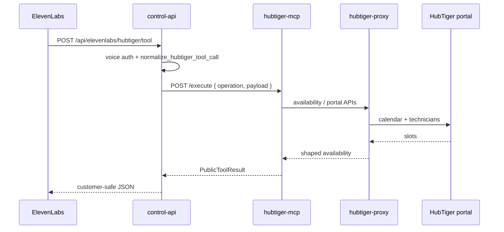

# HubTiger Booking Availability — Operator Handover

This document is the canonical handover for **read-only workshop availability** via ElevenLabs → GhostDASH → HubTiger. It replaces ad-hoc `e:\hubtiger_booking_availability_handover.md` notes on developer machines.

## What you are shipping

- **Customer intent:** “When can I book my bike/scooter in?”
- **Tool name (ElevenLabs):** `hubtiger_booking_availability_readonly`
- **Canonical API:** `POST https://ghoststack.rideai.com.au/api/elevenlabs/hubtiger/tool`
- **Function constant:** `booking_availability` (maps to MCP `availability_lookup`)
- **Does not create bookings** — availability only. Use `booking_create` separately (human-gated in read-only mode).

## ElevenLabs import files (repo)

Import **one** of these (same schema):

- `scripts/hubtiger/hubtiger_booking_availability.json`
- `scripts/hubtiger/hubtiger-api/elevenlabs-tools/hubtiger_booking_availability.json`
- Bundle: `scripts/hubtiger/hubtiger-api/elevenlabs-tools-download/hubtiger_booking_availability_readonly.json`

Required webhook shape keys: `pre_tool_speech`, `content_type`, `response_mocks`, `X-Ghost-Voice-Key` header.

**Do not commit live voice keys in JSON.** Set `X-Ghost-Voice-Key` in the ElevenLabs tool UI to match `ELEVENLABS_HUBTIGER_WEBHOOK_SECRET` or `APP_VOICE_INGRESS_SECRET` in GhostDASH `.env`.

## Request contract (minimal)

```json
{
  "function": "booking_availability",
  "store": "brisbane",
  "start_date": "2026-05-21",
  "end_date": "2026-05-23",
  "cache_mode": "",
  "payload": {
    "service_notes": "general service",
    "preferred_time": "morning"
  }
}
```

| Field | Required | Notes |
|--------|----------|--------|
| `function` | Yes | Constant `booking_availability` in ElevenLabs tool JSON |
| `store` | Yes | Slug: `southport`, `brisbane`, or `burleigh` |
| `start_date` | Yes | `YYYY-MM-DD` |
| `end_date` | No | Defaults to a short window after start |
| `cache_mode` | No | Use `no_cache` only when caller says data feels stale |
| `payload` | No | Optional service notes / preferred time |

Legacy alias URL (narrow helper, same backend operation):

- `POST /api/elevenlabs/hubtiger/booking_availability` with `{ "store", "start_date", "limit" }`

Prefer the **canonical** `/tool` URL for all HubTiger voice tools.

## Architecture (one path)



## Runtime prerequisites

`hubtiger-proxy` health should show:

- `portalMode: true`
- `portalConfigured: true`
- `hasPartnerId: true`, `hasFunctionCode: true`

Set in `.env` (names only — values are environment-specific):

- `HUBTIGER_PORTAL_MODE=true`
- `HUBTIGER_PARTNER_ID`, `HUBTIGER_FUNCTION_CODE` (or `HUBTIGER_API_CODE`)
- `HUBTIGER_USERNAME` / `HUBTIGER_PASSWORD` (portal login)
- `HUBTIGER_MCP_URL=http://hubtiger-mcp:8096` on `control-api`

After code or env changes:

```bash
cd /var/llamaindex/ghoststack-rag
docker compose up -d --build hubtiger-proxy hubtiger-mcp control-api
```

## Verify (from control-api container)

```bash
docker compose exec -T control-api python3 - <<'PY'
import json, os, urllib.request
key = os.environ.get("ELEVENLABS_HUBTIGER_WEBHOOK_SECRET") or os.environ.get("APP_VOICE_INGRESS_SECRET") or ""
body = {"function": "booking_availability", "store": "brisbane", "start_date": "2026-05-21", "payload": {}}
req = urllib.request.Request(
    "http://127.0.0.1:8000/api/elevenlabs/hubtiger/tool",
    data=json.dumps(body).encode(),
    headers={"Content-Type": "application/json", "X-Ghost-Voice-Key": key},
    method="POST",
)
with urllib.request.urlopen(req, timeout=30) as resp:
    print(resp.status, resp.read().decode()[:1200])
PY
```

**Healthy outcomes**

- `success: true` with `slot_count > 0` — offer times to the caller.
- `success: true` with `slot_count: 0` — do **not** invent slots; offer callback or another date.
- `success: false` — retry once with `cache_mode: "no_cache"`; then offer staff follow-up.

**Stale control-api symptom**

If `/tool` returns `Lookup-only mode supports lookup_job`, rebuild/restart `control-api` (image predates multi-function `/api` router).

## Known bug fixed (2026-05-20)

`control-api` previously posted `availability_lookup` to MCP as `{ method, proxy_path }` only. MCP’s `/execute` fast path expects `{ operation, payload: { store, start_date } }`. That mismatch produced **400 / “Booking availability is currently unavailable”** even when portal mode was healthy.

Fix: `build_hubtiger_mcp_post_body()` in `backend/src/ghostdash_api/hubtiger_mcp.py` sends the payload contract for availability.

## Voice agent rules (Magic Mike)

- Ask for **store** and **date** before calling the tool.
- Never read raw JSON, trace IDs, or backend errors to the caller.
- If `success` is false or slots are empty, do not claim availability — offer to check again or connect booking support.

## Related docs

- `docs/HUBTIGER_OPERATOR_PLAYBOOK.md` — full function map and curl examples
- `docs/HUBTIGER_TOOL_ARCHITECTURE.md` — service boundaries
- `artefacts/HUBTIGER_BOOKING_AVAILABILITY_READONLY_JSON_2026-05-01.md` — JSON alignment proof
