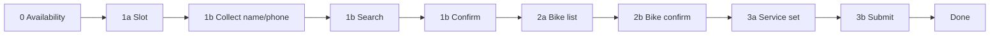

# HubTiger Booking — ElevenLabs Workflow Nodes

**Goal:** One **isolated agent node** per step — small prompt, **one tool max**, speak **`voice_line`** from the API, pass **`booking_session_id`** forward.

Guide index: [`HUBTIGER_BOOKING_STAGED_ELEVENLABS_LLM_GUIDE.md`](./HUBTIGER_BOOKING_STAGED_ELEVENLABS_LLM_GUIDE.md)

Per-node prompts (copy into each ElevenLabs workflow node): `scripts/hubtiger/workflow-prompts/`

---

## Workflow map



| Node ID | Type | Tool JSON | API function |
|---------|------|-----------|--------------|
| `booking_availability` | tool | `hubtiger_booking_availability.json` | `booking_availability` |
| `booking_slot` | tool | `hubtiger_booking_slot.json` | `booking_slot_hold` |
| `booking_customer_collect` | **conversation only** | — | — |
| `booking_customer_search` | tool | `hubtiger_booking_customer_search.json` | `booking_customer_search` |
| `booking_customer_confirm` | tool | `hubtiger_booking_customer_confirm.json` | `booking_customer_confirm` |
| `booking_bike_list` | tool | `hubtiger_booking_bike_list.json` | `booking_bike_list` |
| `booking_bike_confirm` | tool | `hubtiger_booking_bike_confirm.json` | `booking_bike_confirm` |
| `booking_service` | tool | `hubtiger_booking_service_set.json` | `booking_service_set` |
| `booking_submit` | tool | `hubtiger_booking_submit.json` | `booking_submit` |
| `booking_complete` | **conversation only** | — | — |

After every tool call, read **`data.voice_line`** (or top-level `message`) to the customer. Use **`data.workflow_node`** to choose the next edge when you wire transitions in ElevenLabs.

---

## ElevenLabs wiring

### Dynamic variable (required)

Create a workflow variable: **`booking_session_id`**

| When | Action |
|------|--------|
| After `booking_slot` tool returns | Set `booking_session_id` = `data.booking_session_id` |
| Every later tool node | Pass `payload.booking_session_id` = `{{booking_session_id}}` |

### Node rules (all booking nodes)

1. **One tool per node** — do not attach availability + booking tools on the same node.
2. **Short system prompt** — use the matching file under `workflow-prompts/` (not the full Magic Mike mega-prompt).
3. **Speak `voice_line` only** — do not read JSON, candidates arrays, or errors verbatim.
4. **Frustrated callers:** acknowledge once (“I hear you — let’s sort this”), then **one** clear question or action.
5. **Timeouts:** availability 25s, slot/search/list/service 15s, confirm 20s, submit 45s.

### Edge conditions (suggested)

| From | To when |
|------|---------|
| `booking_availability` | Customer picks a time → `booking_slot` |
| `booking_slot` | `workflow_node` = `booking_customer_search` |
| `booking_customer_collect` | Have first name, last name, mobile → `booking_customer_search` |
| `booking_customer_search` | Always → `booking_customer_confirm` |
| `booking_customer_confirm` | `customer_confirmed` true → `booking_bike_list` |
| `booking_bike_list` | Always → `booking_bike_confirm` |
| `booking_bike_confirm` | `bike_confirmed` true → `booking_service` (collect + tool) |
| `booking_service` | `service_confirmed` true → `booking_submit` |
| `booking_submit` | `booking_confirmed` or explain pending → `booking_complete` |

---

## Step 3 split (why two nodes)

| Node | Speed | Work |
|------|-------|------|
| **3a `booking_service_set`** | Fast (~session write) | Saves service + issue while you reassure the customer |
| **3b `booking_submit`** | Slower (HubTiger write) | Creates the job; may be staff-gated |

Splitting avoids a long silent gap while the customer thinks the call dropped.

---

## Tool list (import all)

```
scripts/hubtiger/hubtiger_booking_availability.json
scripts/hubtiger/hubtiger_booking_slot.json
scripts/hubtiger/hubtiger_booking_customer_search.json
scripts/hubtiger/hubtiger_booking_customer_confirm.json
scripts/hubtiger/hubtiger_booking_bike_list.json
scripts/hubtiger/hubtiger_booking_bike_confirm.json
scripts/hubtiger/hubtiger_booking_service_set.json
scripts/hubtiger/hubtiger_booking_submit.json
```

Legacy single node: `hubtiger_booking_finalize.json` (= service + submit in one call). Prefer **service_set → submit** in workflows.

---

## Workshop hours

Monday–Saturday **8:30am–5:00pm** Brisbane only.
