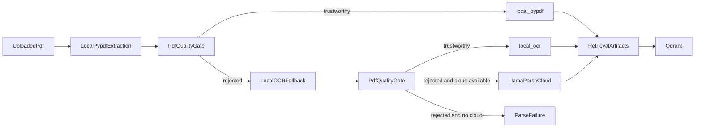

# Local OCR PDF Fallback Artifact

## Goal

Repair PDF ingestion for image-heavy or webpage-style PDFs that fail deterministic `pypdf` extraction when cloud parsing is unavailable.

The live failing case used for validation was:

- `Australia_s economy growing at fastest rate in almost three years - ABC News.pdf`

## Root Cause

The failure was not a general upload or indexing defect. The actual problem was a parser gap in the local PDF lane:

1. `pypdf` extracted only the repeated webpage title and URL banner plus page counters from the ABC PDF.
2. The repeated-header cleanup removed the banner text from every page.
3. That left only `1 of 6`, `2 of 6`, etc., so `assess_pdf_local_quality()` correctly classified the result as low-signal garbage.
4. Runtime policy was `pdf_parse_lane_policy = auto`, but cloud parsing was unavailable, so the document failed with no viable fallback.

## Fix Applied

Updated `backend/src/ghostdash_api/ingest.py`:

- added `_local_ocr_available()` to detect OCR-capable local dependencies
- added `extract_pdf_pages_ocr_local()` using `pypdfium2` page rendering plus `rapidocr-onnxruntime`
- extended PDF diagnostics with an `ocr` block
- updated `extract_pdf_documents()` so:
  - `default + auto` tries `local_pypdf`, then `local_ocr`, then cloud
  - `local` and `local_default` can use `local_ocr` before failing
  - `cloud_default` can use `local_ocr` on local fallback when cloud fails

Updated `backend/pyproject.toml`:

- added `pypdfium2`
- added `rapidocr-onnxruntime`

Updated `backend/Dockerfile`:

- added runtime shared libraries required by the OCR/OpenCV stack:
  - `libglib2.0-0`
  - `libgl1`
  - `libsm6`
  - `libxext6`
  - `libxrender1`
  - `libxcb1`

Updated `backend/tests/test_pdf_parse_policy.py`:

- added regression coverage for `auto -> local_ocr`
- added regression coverage for `local -> local_ocr`
- preserved the fail path when OCR is unavailable and cloud is unavailable

## Architecture



## Why This Fix Is Fit For Purpose

- It does not weaken the existing deterministic `pypdf` quality gate for normal PDFs.
- It avoids indexing obvious garbage just to force a green status.
- It introduces a genuinely stronger local fallback for scanned/image-style PDFs instead of duplicating ingestion state.
- It keeps actual execution lanes explicit:
  - `local_pypdf`
  - `local_ocr`
  - `llamaparse`

## Live Verification

An isolated collection was created:

- `abc-ocr-retest`

The existing failing ABC PDF was replayed into that collection and re-synced after the OCR fix.

Observed result:

- task status: `completed`
- document `actual_parse_lane`: `local_ocr`
- `parse_status`: `completed`
- `index_status`: `completed`
- `error_message`: empty

## Acceptance Criteria

- PDFs that fail `pypdf` but contain OCR-recoverable page content can complete indexing without cloud parsing.
- Normal text PDFs remain on `local_pypdf` and are not forced through OCR.
- If OCR dependencies are missing or OCR still produces unusable text, the failure message remains explicit instead of silently indexing junk.
- The resulting document row records the real lane as `local_ocr` when OCR wins.

## Exact Verify Commands

```bash
cd /var/llamaindex/ghoststack-rag
git status -sb
docker ps --format 'table {{.Names}}\t{{.Image}}\t{{.Ports}}'
docker logs --tail=120 ghoststack-rag-control-api-1
docker logs --tail=120 ghoststack-rag-workflow-runtime-1

cd /var/llamaindex/ghoststack-rag
docker compose build workflow-runtime control-api agent-ingress
docker compose up -d workflow-runtime control-api agent-ingress

cd /var/llamaindex/ghoststack-rag
python3 - <<'PY'
import json, urllib.request
payload=json.dumps({'slug':'abc-ocr-retest','name':'ABC OCR Retest'}).encode()
req=urllib.request.Request('http://localhost/api/collections', data=payload, headers={'Content-Type':'application/json'}, method='POST')
try:
    print(urllib.request.urlopen(req, timeout=30).read().decode())
except Exception as exc:
    print(exc)
PY

cd /var/llamaindex/ghoststack-rag
docker exec ghoststack-rag-control-api-1 sh -lc "python - <<'PY'
import urllib.request
boundary='----WebKitFormBoundaryGhostDash'
file_path='/data/uploads/re-finance26/Australia_s economy growing at fastest rate in almost three years - ABC News.pdf'
with open(file_path, 'rb') as f:
    content = f.read()
parts = []
parts.append(f'--{boundary}\r\nContent-Disposition: form-data; name=\"corpus\"\r\n\r\nabc-ocr-retest\r\n'.encode())
parts.append(f'--{boundary}\r\nContent-Disposition: form-data; name=\"policy_lane\"\r\n\r\ndefault\r\n'.encode())
parts.append((f'--{boundary}\r\nContent-Disposition: form-data; name=\"file\"; filename=\"Australia_s economy growing at fastest rate in almost three years - ABC News.pdf\"\r\nContent-Type: application/pdf\r\n\r\n').encode() + content + b'\r\n')
parts.append(f'--{boundary}--\r\n'.encode())
req=urllib.request.Request('http://control-api:8000/api/upload', data=b''.join(parts), method='POST', headers={'Content-Type': f'multipart/form-data; boundary={boundary}'})
print(urllib.request.urlopen(req, timeout=120).read().decode())
PY"

cd /var/llamaindex/ghoststack-rag
python3 - <<'PY'
import json, time, urllib.request
base='http://localhost'
req=urllib.request.Request(base+'/api/sync', data=json.dumps({'corpus':'abc-ocr-retest'}).encode(), headers={'Content-Type':'application/json'}, method='POST')
task=json.load(urllib.request.urlopen(req, timeout=120))
state=task
for _ in range(180):
    if state['status'] in {'completed','failed'}:
        break
    time.sleep(2)
    state=json.load(urllib.request.urlopen(base+'/api/tasks/'+task['id'], timeout=120))
print(json.dumps(state, indent=2))
print(urllib.request.urlopen(base+'/api/documents?corpus=abc-ocr-retest', timeout=120).read().decode())
PY

cd /var/llamaindex/ghoststack-rag
docker exec ghoststack-rag-postgres-1 psql -U ghostdash -d ghostdash -At -F $'\t' -c \
"select filename, actual_parse_lane, parse_status, index_status, coalesce(error_message, '') from documents where corpus = 'abc-ocr-retest' order by updated_at desc limit 1;"

docker run --rm -v \"/var/llamaindex/ghoststack-rag/backend:/app\" -w /app ghoststack-rag-workflow-runtime sh -lc \
'pip install pytest >/dev/null && PYTHONPATH=src pytest tests/test_pdf_parse_policy.py -q'
```

## Human Retest

Please test from the UI as a human operator:

1. Open `Data Sources`.
2. Upload the same ABC PDF with `Default (runtime policy)`.
3. Start sync.
4. Confirm the document no longer fails.
5. Confirm the row shows `requested: Default (runtime policy)` and `actual: local_ocr`.
6. Ask the agent a question grounded in that article and confirm retrieval returns article content rather than just page counters.
