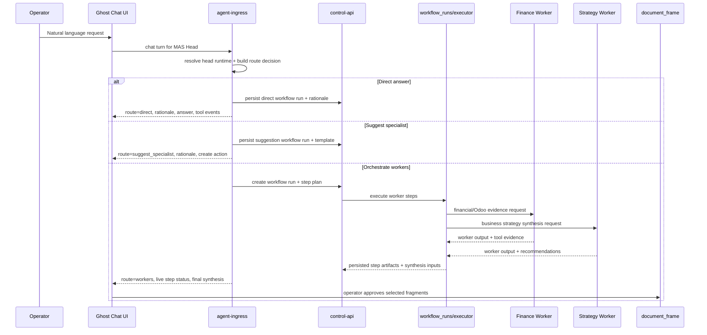

# feat: Simplify MAS With Transparent Head Orchestrator

## Overview

Introduce a single visible MAS operator chat built around one head LLM runtime (`mistral3-8b`) that the operator talks to naturally. For each turn, the head decides whether to answer directly, suggest a new specialist, or orchestrate existing worker agents such as Finance and Business Strategy on stronger models. The backend remains the execution owner, while the UI becomes a transparent projection of route choice, worker activity, tool evidence, and document approval state.

This plan intentionally does **not** expose raw chain-of-thought. "Thinking" is represented as structured routing rationale, run/step state, tool events, evidence summaries, and synthesis provenance. That matches existing GhostDASH truth contracts and avoids another opaque prompt-only orchestration layer.

## Problem Frame

GhostDASH currently behaves like an agent picker with workflow-specific modes layered on top. That is powerful but too hard for MAS to operate because the operator has to know which agent to pick, what tools are enabled, and whether the system actually did what it claimed.

The requested operator model is simpler:

- one visible chat surface, like this conversation
- one head LLM that accepts normal operator requests
- head decides whether to answer, escalate, or recommend a specialist
- larger worker agents can collaborate under the hood
- operator can see why the route was chosen and what each worker is doing
- document generation remains approval-based and grounded in explicit evidence

The system must feel easier while becoming more transparent, not more magical. The wrong move here would be adding another hidden orchestration layer, a second runtime state model, or raw "thinking" text that cannot be trusted or replayed.

## Requirements Trace

- R1. MAS uses one default visible chat surface with one head operator agent instead of forcing up-front specialist selection.
- R2. The head agent supports three explicit turn outcomes: direct answer, suggest/create specialist, or orchestrate worker agents.
- R3. Every routed turn shows operator-visible reasoning as structured rationale, not hidden prompt behavior or raw chain-of-thought.
- R4. Worker execution is durable, replayable, and inspectable from persisted workflow run state rather than browser-only state.
- R5. Existing runtime profiles, workflow runs, tool truth events, and document frames remain the canonical backend sources of truth.
- R6. Financial/Odoo-backed work stays grounded in explicit tool events and evidence hierarchy; the UI must not imply execution from citations or prose.
- R7. Document-oriented flows still require explicit approval before content is promoted into shared `document_frame` state.
- R8. Head and worker model assignment remains editable through existing agent/runtime-profile ownership rules, with no hidden defaults or read-path mutation.

## Scope Boundaries

- Do not expose raw chain-of-thought or private prompt traces in the operator UI.
- Do not build a second orchestration store outside existing workflow run records.
- Do not create browser-owned worker coordination that can drift from backend truth.
- Do not silently auto-create new specialist agents without operator approval.
- Do not replace the current document-frame model; extend it through the new orchestration path.

## Context & Research

### Relevant Code and Patterns

- `backend/src/ghostdash_api/agent_ingress.py`: current turn runtime, SSE surface, tool event emission, and persisted message usage/tool state.
- `backend/src/ghostdash_api/workflows.py`: current routing primitive via `build_query_plan()`, which already distinguishes direct answers from tool-backed handling.
- `backend/src/ghostdash_api/workflow_runs.py`: durable workflow definition, run, and step records.
- `backend/src/ghostdash_api/workflow_run_executor.py`: backend-owned workflow execution and child-step synthesis pattern.
- `backend/src/ghostdash_api/control_api.py`: authoritative control-plane API for agents, conversations, document frames, workflow definitions, and workflow runs.
- `backend/src/ghostdash_api/agent_memory.py`: seeded specialist agents and runtime-profile ownership rules.
- `backend/src/ghostdash_api/runtime_profiles.py`: runtime-profile defaults, tool policy normalization, and system prompt ownership.
- `backend/src/ghostdash_api/models.py` and `backend/src/ghostdash_api/schemas.py`: persistence and API contracts for agent messages, workflow runs, and document frames.
- `ui/src/api.ts`: frontend contract layer that must start consuming workflow run and transparency metadata.
- `ui/src/hooks/useChatEngine.ts`: current chat state owner and the best seam for head-run transparency state.
- `ui/src/pages/chat/ChatPage.tsx`, `ui/src/pages/chat/ChatArea.tsx`, `ui/src/pages/chat/MessageList.tsx`, `ui/src/pages/chat/ChatSidebar.tsx`: primary operator surfaces for route visibility and worker traces.
- `ui/src/pages/AgentConfigPage.tsx`: canonical surface for editable head/worker runtime assignment.

### Institutional Learnings

- `artefacts/GHOST_CHAT_AGENT_RUNTIME_TRUTH_CONTRACT_2026-04-15.md`: runtime profile must remain the behavior source of truth; read paths must not mutate runtime state.
- `artefacts/GHOST_CHAT_TOUCHPOINT_LEDGER_2026-04-15.md`: persisted tool events and usage must drive reloads; UI reconstruction from citations is not acceptable.
- `artefacts/GHOST_CHATUI_ODOO_EXECUTION_TRUTH_CONTRACT_2026-04-15.md`: tool execution must be shown as explicit states such as executed, blocked, failed, or planned only.
- `artefacts/APPROVAL_AND_TRUTH_GROUNDING_SPEC_2026-04-15.md`: evidence has an explicit hierarchy and approval gates remain mandatory for document promotion.
- `artefacts/MAS_PHASE3_SERVER_EXECUTION_2026-04-10.md`: orchestration must be server-owned and durable rather than browser-owned.
- `artefacts/MAS_PHASE4_HEAD_AGENT_JSON_YAML_2026-04-10.md`: head-agent orchestration should be definition-driven and inspectable, not hidden in freeform prompts.
- `docs/MILESTONE1_RUNTIME_PROFILE_ARTIFACT.md`: avoid duplicate ownership of model/tool policy across UI, workflow rows, and runtime profiles.

### External References

- None. The repo already has strong local patterns for workflow execution, truth contracts, and chat/runtime ownership, so planning stays grounded in local architecture.

## Key Technical Decisions

- Use a **single head operator agent** as the default MAS chat entrypoint rather than asking operators to pick a specialist first. This improves ease of use without removing specialist capability.
- Represent "thinking" as a **structured routing rationale contract** containing route choice, rationale summary, expected evidence/tool posture, and worker plan summary. Do not expose raw chain-of-thought.
- Reuse **`WorkflowRunRecord` and `WorkflowStepRunRecord`** as the durable truth source for all orchestrated turns, including turns where the head chooses to answer directly.
- Add a new **head-orchestrator workflow mode / route type** instead of overloading existing `data_collector`, `documenter`, and `odoo_specialist` modes.
- Keep **runtime profiles** as the single owner of model, tool, and guardrail configuration. The plan seeds a head agent and worker agents but does not create new parallel ownership fields.
- Start with **sequential worker orchestration** using existing executor patterns. Parallel fan-out can be added later if the durable contract proves stable.
- Treat **specialist creation as assisted and operator-approved**, not silent. The head can recommend or prefill a template, but creation remains explicit.
- Preserve the existing **document-frame approval lane** so strategist/documenter outputs only become shared drafting material after user approval.

## Open Questions

### Resolved During Planning

- How should visible thinking work: use structured rationale cards, route summaries, worker state, and evidence traces instead of raw reasoning text.
- Where should orchestration truth live: persisted workflow definitions/runs/steps owned by the backend.
- How should document handoff work: keep the existing `document_frame` and approved fragment workflow as the canonical drafting mechanism.
- How should specialist creation work: the head can suggest and scaffold creation, but the operator must explicitly approve creating a new specialist.

### Deferred to Implementation

- Exact `mistral3-8b` connection slug and model id, because that depends on the configured provider catalog at execution time.
- Whether worker fan-out should remain sequential or gain safe parallel execution after the first stable release.
- Whether the transparency UI lives entirely inside `ChatArea`/`MessageList` or also gets a dedicated run-history page backed by workflow APIs.
- Whether the head should support per-turn "stay direct" or "always escalate finance" operator overrides in the first release.

## High-Level Technical Design

> *This illustrates the intended approach and is directional guidance for review, not implementation specification. The implementing agent should treat it as context, not code to reproduce.*

## Implementation Units

- [ ] **Unit 1: Add head-orchestrator routing contract**

**Goal:** Introduce a first-class routing contract for the MAS head agent so each turn explicitly resolves to direct answer, specialist suggestion, or worker orchestration.

**Requirements:** R1, R2, R3, R5, R8

**Dependencies:** None

**Files:**
- Modify: `backend/src/ghostdash_api/schemas.py`
- Modify: `backend/src/ghostdash_api/models.py`
- Modify: `backend/src/ghostdash_api/agent_ingress.py`
- Modify: `backend/src/ghostdash_api/workflows.py`
- Modify: `backend/src/ghostdash_api/workflow_runtime.py`
- Modify: `backend/src/ghostdash_api/control_api.py`
- Modify: `ui/src/api.ts`
- Test: `backend/tests/test_agent_ingress_prompt_hotfix.py`
- Test: `backend/tests/test_workflows_odoo_planning.py`
- Test: `backend/tests/test_connections_and_bootstrap.py`

**Approach:**
- Define a route decision payload that includes `route_type`, `rationale_summary`, `recommended_workers`, `suggested_specialist_template`, `tool_expectations`, and `document_intent`.
- Ensure every MAS head turn produces this payload even when the final answer is direct, so the UI always has a visible explanation of what happened.
- Extend existing chat/SSE payloads to carry this route contract without forcing the frontend to infer it from answer text.
- Keep route generation bounded by runtime-profile-owned tool readiness and evidence hierarchy.

**Patterns to follow:**
- `backend/src/ghostdash_api/workflows.py` query planning contract
- `artefacts/GHOST_CHATUI_ODOO_EXECUTION_TRUTH_CONTRACT_2026-04-15.md`

**Test scenarios:**
- Happy path: a general informational prompt produces `route_type=direct` with a concise rationale and no worker launch.
- Happy path: a finance-heavy prompt produces `route_type=workers` with finance and strategy worker recommendations.
- Happy path: a prompt outside the current specialist catalog produces `route_type=suggest_specialist` with a suggested template instead of silent creation.
- Edge case: a finance request arrives while Odoo is unavailable and the route contract marks the worker/tool posture as blocked rather than pretending execution.
- Error path: if the route contract cannot be generated, the turn returns an explicit operator-visible fallback rather than hidden default-agent behavior.
- Integration: SSE start/tool/done payloads expose the same route contract that message reloads later show from persisted state.

**Verification:**
- Every head turn has a stable, replayable route decision object visible through API and UI state.

- [ ] **Unit 2: Persist MAS orchestration runs and worker step artifacts**

**Goal:** Reuse the workflow run system so all worker orchestration is durable, inspectable, and server-owned.

**Requirements:** R2, R3, R4, R5, R6

**Dependencies:** Unit 1

**Files:**
- Modify: `backend/src/ghostdash_api/workflow_runs.py`
- Modify: `backend/src/ghostdash_api/workflow_run_executor.py`
- Modify: `backend/src/ghostdash_api/control_api.py`
- Modify: `backend/src/ghostdash_api/models.py`
- Modify: `backend/src/ghostdash_api/schemas.py`
- Test: `backend/tests/test_workflow_runs.py`
- Test: `backend/tests/test_workflow_run_executor.py`
- Test: `backend/tests/test_connections_and_bootstrap.py`

**Approach:**
- Add explicit MAS run/step types for head decision, worker execution, worker synthesis, and specialist suggestion.
- Persist per-step metadata for worker identity, model/runtime profile, tool events, evidence summaries, output summaries, and failure status.
- Make direct answers use a one-step run so the operator experience remains consistent across all routes.
- Keep execution backend-owned; the browser subscribes to run status and renders persisted state instead of coordinating workers itself.

**Execution note:** Start with characterization coverage around existing workflow run serialization before extending step metadata.

**Patterns to follow:**
- `backend/src/ghostdash_api/workflow_run_executor.py`
- `artefacts/MAS_PHASE3_SERVER_EXECUTION_2026-04-10.md`

**Test scenarios:**
- Happy path: a worker orchestration run persists head step, finance step, strategy step, and synthesis step in dependency order.
- Happy path: a direct-answer turn still creates a durable run with one visible step and final synthesis metadata.
- Edge case: a worker returns no useful evidence and the run records a degraded but truthful synthesis path.
- Error path: one worker fails; the run marks that step failed, preserves completed worker output, and returns a bounded synthesis/error state instead of disappearing.
- Integration: reloading the conversation restores worker step state from workflow records rather than browser memory.

**Verification:**
- MAS orchestration can be replayed and inspected from persisted run rows with no reliance on transient UI state.

- [ ] **Unit 3: Seed and govern the MAS head/worker agent model**

**Goal:** Establish an editable MAS head agent plus canonical worker agents without reintroducing hidden defaults or runtime drift.

**Requirements:** R1, R2, R5, R8

**Dependencies:** Unit 1

**Files:**
- Modify: `backend/src/ghostdash_api/agent_memory.py`
- Modify: `backend/src/ghostdash_api/runtime_profiles.py`
- Modify: `backend/src/ghostdash_api/control_api.py`
- Modify: `ui/src/pages/AgentConfigPage.tsx`
- Test: `backend/tests/test_runtime_profiles.py`
- Test: `backend/tests/test_connections_and_bootstrap.py`

**Approach:**
- Seed a `MAS Head Operator` agent with a runtime profile intended for `mistral3-8b`, plus worker agents for finance and business strategy on stronger models.
- Keep all model/tool/guardrail ownership in runtime profiles and preserve the recent "do not overwrite operator edits" contract.
- Add explicit agent metadata that marks agents as `head`, `worker_finance`, `worker_strategy`, or `suggestable_specialist` so the orchestrator has canonical routing targets.
- Support operator-approved specialist creation by templating a runtime profile from the head recommendation rather than inventing ad hoc agent rows.

**Patterns to follow:**
- `backend/src/ghostdash_api/agent_memory.py`
- `artefacts/GHOST_CHAT_AGENT_RUNTIME_TRUTH_CONTRACT_2026-04-15.md`

**Test scenarios:**
- Happy path: bootstrap returns the MAS head agent as the default visible operator agent.
- Happy path: worker agents are discoverable as orchestration targets but are not required as the primary operator chat selection.
- Edge case: an operator edits the head or worker model id and later reads do not revert the change.
- Error path: creating a suggested specialist without an explicit runtime profile still fails clearly instead of attaching a hidden default.
- Integration: agent configuration surfaces display role metadata and editable runtime assignment without duplicating ownership in UI-only fields.

**Verification:**
- MAS can run with one default head agent while preserving editable, truth-backed worker runtimes.

- [ ] **Unit 4: Build the transparency-first MAS chat UI**

**Goal:** Make MAS easy to use by showing route choice, worker state, evidence posture, and next actions directly in the chat experience.

**Requirements:** R1, R2, R3, R4, R6

**Dependencies:** Units 1-3

**Files:**
- Modify: `ui/src/api.ts`
- Modify: `ui/src/hooks/useChatEngine.ts`
- Modify: `ui/src/pages/chat/ChatPage.tsx`
- Modify: `ui/src/pages/chat/ChatArea.tsx`
- Modify: `ui/src/pages/chat/MessageList.tsx`
- Modify: `ui/src/pages/chat/ChatSidebar.tsx`
- Modify: `ui/src/components/GhostChat.tsx`
- Test: `backend/tests/test_connections_and_bootstrap.py`

**Approach:**
- Add a turn-level transparency card showing head model, chosen route, rationale summary, expected tools/evidence, and active workflow run id.
- Add a worker activity panel or inline step timeline showing pending/running/completed/blocked/failed worker states, tool events, and short output summaries.
- Add explicit operator actions for "stay direct", "approve suggested specialist", "show worker details", and "approve for document" where relevant.
- Keep chat composition simple: the operator still types into one box; the system surface explains what happened after send.

**Technical design:** *(directional guidance, not implementation specification)*
- Use one canonical state object in `useChatEngine.ts` for `activeRouteDecision`, `activeWorkflowRun`, and `workerStepViews`.
- Hydrate from persisted API payloads on reload; do not reconstruct status from answer text or badges.

**Patterns to follow:**
- `ui/src/hooks/useChatEngine.ts`
- `artefacts/GHOST_CHAT_TOUCHPOINT_LEDGER_2026-04-15.md`
- `artefacts/GHOST_CHATUI_ODOO_EXECUTION_TRUTH_CONTRACT_2026-04-15.md`

**Test scenarios:**
- Happy path: a direct-answer turn shows why it stayed direct and does not confuse the operator with empty worker panels.
- Happy path: a worker turn shows both worker identities, current statuses, and short summaries as they progress.
- Edge case: a blocked worker shows a blocked state and reason instead of vanishing or silently degrading into prose.
- Error path: if the workflow run API lags or returns partial data, the UI shows a clear loading/degraded state without inventing worker progress.
- Integration: refreshing the page mid-run restores route card and worker timeline from persisted API state.

**Verification:**
- MAS feels like one simple chat surface while making routing and worker activity explicit enough for operator trust.

- [ ] **Unit 5: Re-anchor document generation in explicit approval checkpoints**

**Goal:** Preserve and strengthen the current document workflow so worker outputs can inform long-form strategy documents without silent promotion.

**Requirements:** R5, R6, R7

**Dependencies:** Units 2 and 4

**Files:**
- Modify: `backend/src/ghostdash_api/agent_memory.py`
- Modify: `backend/src/ghostdash_api/control_api.py`
- Modify: `backend/src/ghostdash_api/schemas.py`
- Modify: `ui/src/hooks/useChatEngine.ts`
- Modify: `ui/src/pages/chat/MessageList.tsx`
- Modify: `ui/src/pages/chat/ChatSidebar.tsx`
- Test: `backend/tests/test_connections_and_bootstrap.py`

**Approach:**
- Allow head or worker outputs to nominate candidate document fragments, but require explicit operator approval before any fragment reaches `document_frame`.
- Make document intent visible in the route contract so the operator can tell when the system is gathering evidence versus drafting.
- Show current document-frame state in the chat sidebar or transparency surface so MAS can see what has already been approved.
- Ensure documenter-style worker outputs remain grounded in approved evidence, not just other agent prose.

**Patterns to follow:**
- `backend/src/ghostdash_api/agent_memory.py`
- `artefacts/APPROVAL_AND_TRUTH_GROUNDING_SPEC_2026-04-15.md`
- `artefacts/GHOSTDASH_STRATEGIC_DOCUMENT_WORKFLOW_2026-04-15.md`

**Test scenarios:**
- Happy path: a strategist/finance worker output can be approved and appears in the correct `document_frame`.
- Happy path: the head synthesizes a draft plan while clearly marking which fragments are approved versus pending approval.
- Edge case: multiple candidate fragments exist and only a subset is approved; the document frame reflects only approved items.
- Error path: if document-frame persistence fails, the UI preserves approval intent and shows the failure explicitly instead of pretending handoff succeeded.
- Integration: document-aware conversations retain the existing document frame when routed through the MAS head agent.

**Verification:**
- Long-form document generation stays collaborative, explicit, and evidence-backed under the new head-orchestrated UX.

- [ ] **Unit 6: Add observability, rollout gates, and MAS operator verification**

**Goal:** Make the new MAS path supportable in production and verify it from a real operator perspective.

**Requirements:** R3, R4, R6, R8

**Dependencies:** Units 1-5

**Files:**
- Modify: `backend/src/ghostdash_api/telemetry.py`
- Modify: `backend/src/ghostdash_api/agent_ingress.py`
- Modify: `backend/src/ghostdash_api/workflow_run_executor.py`
- Modify: `docs/ARCHITECTURE.md`
- Modify: `docs/OPERATIONS.md`
- Test: `backend/tests/test_agent_ingress_prompt_hotfix.py`
- Test: `backend/tests/test_workflow_run_executor.py`
- Test: `backend/tests/test_connections_and_bootstrap.py`

**Approach:**
- Propagate `trace_id`, route type, workflow run id, worker step ids, and tool event summaries across head and worker execution boundaries.
- Add operator-facing verification guidance for direct-answer, worker-run, blocked-tool, suggested-specialist, and document-approval scenarios.
- Gate rollout behind a feature flag or default-agent switch so the team can test the MAS head without breaking existing specialist-first flows.
- Update architecture and operations docs to describe the head/worker runtime model and the canonical debugging surfaces.

**Patterns to follow:**
- `docs/ARCHITECTURE.md`
- `artefacts/GHOST_CHAT_TOKEN_ACCOUNTING_CONTRACT_2026-04-15.md`
- observability conventions already used in `backend/src/ghostdash_api/telemetry.py`

**Test scenarios:**
- Happy path: a traced MAS run shows head route selection, worker execution, synthesis, and final answer under one trace context.
- Edge case: a retried worker step does not double-count visible usage or create duplicate operator-visible conclusions.
- Error path: a timed-out worker step emits a visible failed state, preserved trace metadata, and a bounded final operator message.
- Integration: switching the default head agent on/off does not break existing specialist-first conversations.
- Test expectation: none -- frontend automated UI coverage is not currently established in this repo, so verification here is primarily backend contract coverage plus human-run chat validation.

**Verification:**
- Operators and developers can both see what happened in a MAS turn without reading backend logs or reverse-engineering hidden prompt behavior.

## System-Wide Impact

- **Interaction graph:** `ui` -> `agent-ingress` remains the operator entrypoint; `agent-ingress` produces route decisions and delegates durable execution through `control-api` + workflow run execution; worker outputs flow back into chat and optional document-frame approvals.
- **Error propagation:** worker or tool failures must appear as explicit route/step states that the head can synthesize around without hiding the failure.
- **State lifecycle risks:** route decision, workflow run, step outputs, tool events, usage, and document approvals must remain correlated across SSE updates and reload paths.
- **API surface parity:** both `ChatPage` and embedded `GhostChat` must consume the same transparency contract to avoid another dual-surface drift problem.
- **Integration coverage:** the most important proof points are run persistence, UI rehydration, document approval continuity, and blocked-tool honesty.
- **Unchanged invariants:** runtime profiles remain the model/tool/guardrail source of truth; `document_frame` remains the only durable approved drafting state; tool execution claims remain event-backed.

## Risks & Dependencies

| Risk | Mitigation |
|------|------------|
| Head-agent orchestration adds another hidden abstraction layer | Make every turn emit a durable route contract and workflow run, even for direct answers |
| UI becomes visually noisy while trying to be transparent | Keep one simple chat composer and collapse detail into structured cards/timelines with progressive disclosure |
| Model/tool ownership drifts across runtime profiles, workflow rows, and frontend state | Keep runtime profiles canonical; workflow rows reference runtime/profile ids and snapshot summaries, not duplicate editable config |
| Worker collaboration becomes brittle if parallelism is introduced too early | Start with sequential execution and add parallel fan-out only after the durable run model stabilizes |
| Suggested specialist creation becomes another source of silent defaults | Make specialist creation operator-approved and require explicit runtime profile payloads |
| Finance/Odoo trust erodes if blocked or failed tool states are hidden | Surface blocked/failed/planned-only tool posture explicitly in both route decision and worker step views |

## Documentation / Operational Notes

- Update `docs/ARCHITECTURE.md` to include the MAS head/worker interaction graph and ownership boundaries.
- Update `docs/OPERATIONS.md` with real debugging paths for `ghoststack-rag-agent-ingress-1` and `ghoststack-rag-control-api-1`, not legacy container names.
- Preserve a detailed architecture artefact for this rollout so MAS can inspect the intended behavior and trace boundaries during implementation and testing.

## Sources & References

- Related code: `backend/src/ghostdash_api/agent_ingress.py`
- Related code: `backend/src/ghostdash_api/workflow_run_executor.py`
- Related code: `ui/src/hooks/useChatEngine.ts`
- Related code: `ui/src/pages/chat/MessageList.tsx`
- Reference: `docs/ARCHITECTURE.md`
- Reference: `artefacts/GHOST_CHAT_AGENT_RUNTIME_TRUTH_CONTRACT_2026-04-15.md`
- Reference: `artefacts/GHOST_CHAT_TOUCHPOINT_LEDGER_2026-04-15.md`
- Reference: `artefacts/APPROVAL_AND_TRUTH_GROUNDING_SPEC_2026-04-15.md`
